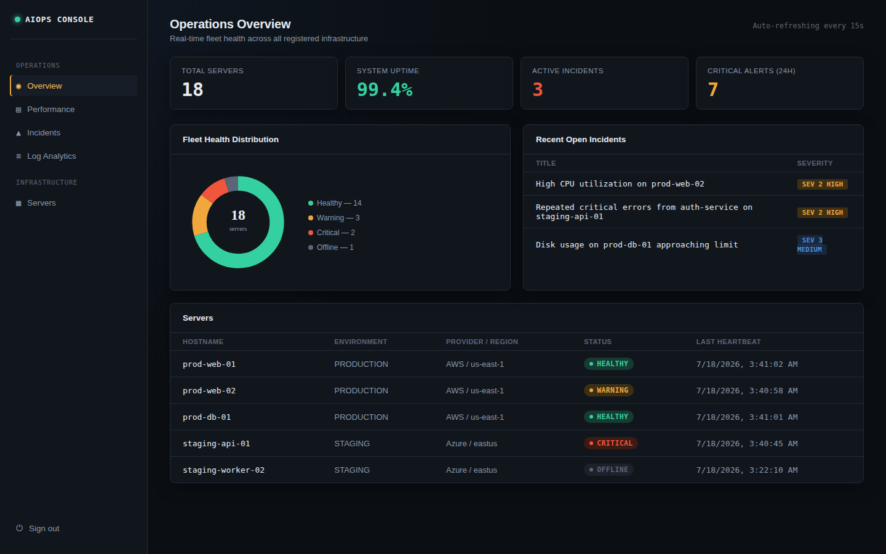
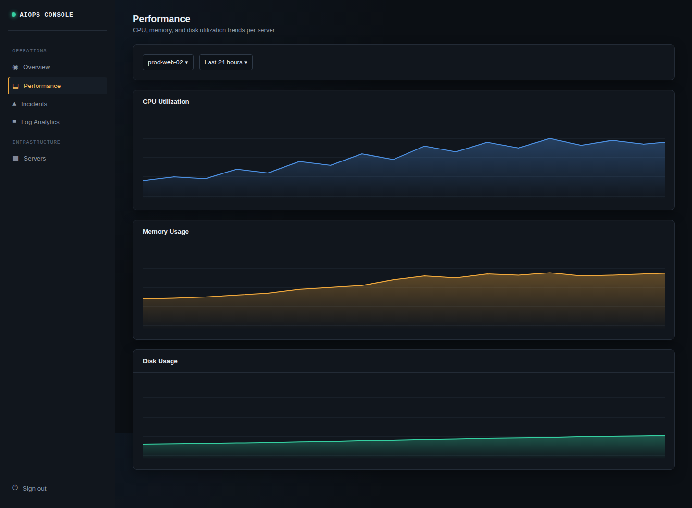
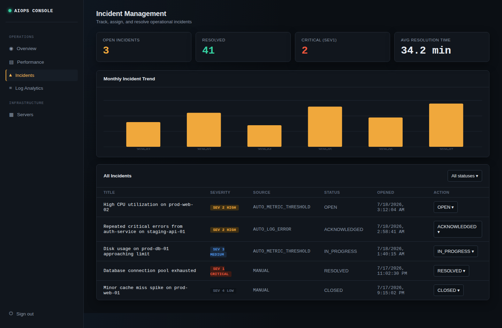
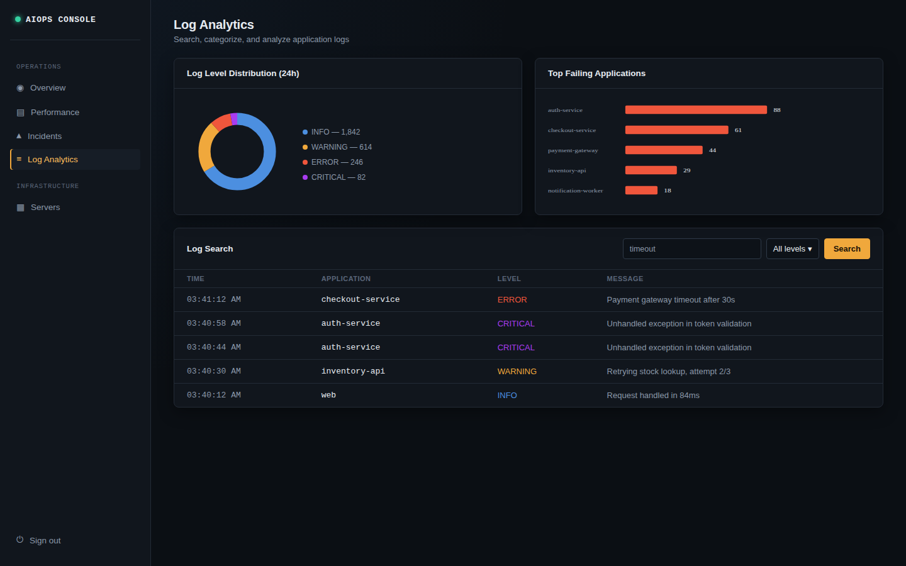
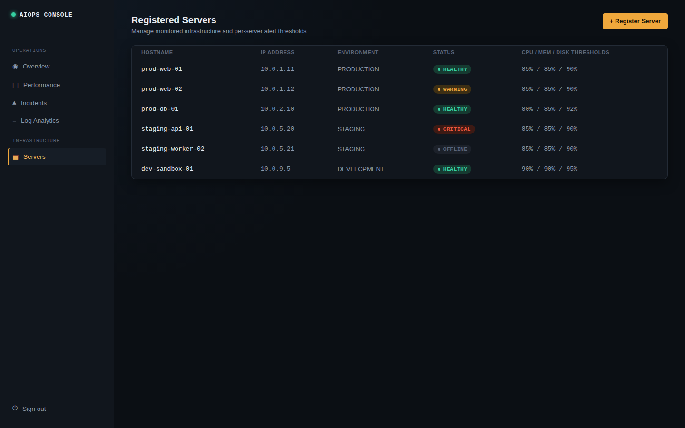
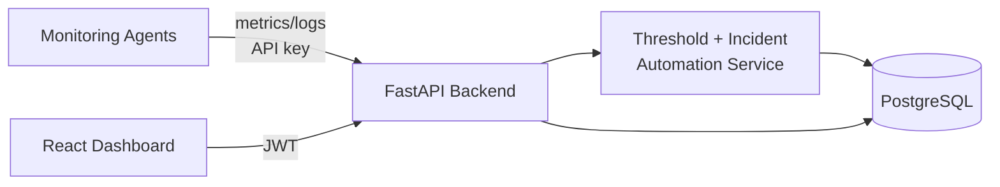

# AIOps Infrastructure Monitoring & Incident Management Platform

An enterprise-style AIOps platform for monitoring server infrastructure,
analyzing application logs, and managing operational incidents — built to
demonstrate the same architectural patterns used in production monitoring
tools like Datadog, New Relic, and Dynatrace, at a scope appropriate for a
single engineer to build, test, and operate.

[](.github/workflows/ci.yml)
[](LICENSE)
[](backend/requirements.txt)
[](backend/requirements.txt)
[](frontend/package.json)
[](database/schema.sql)

---

## Why this project

Most portfolio monitoring apps display metrics. This one **reasons about
them**: it evaluates every incoming metric and log line against configurable
thresholds, raises alerts, and automatically opens incidents — including
de-duplicating them so a sustained outage doesn't spam ten near-identical
tickets. That automation loop (collect -> evaluate -> alert -> incident) is
the actual job of an AIOps platform, not just the charts on top of it.

## Screenshots

> UI mockups styled with the project's real design tokens/CSS, shown here
> populated with representative demo data. Swap in live captures of your own
> running instance after `docker compose up` — see [`screenshots/README.md`](screenshots/README.md).

| Overview | Performance |
|---|---|
|  |  |

| Incidents | Log Analytics |
|---|---|
|  |  |

| Servers |
|---|
|  |

## Core Capabilities

- **Infrastructure Monitoring** — register servers, collect CPU/memory/disk/
  network/process metrics via a lightweight Python agent, track health status
  and heartbeat.
- **Log Management** — ingest, categorize (`INFO`/`WARNING`/`ERROR`/`CRITICAL`),
  search, and analyze application logs; surfaces the top failing services.
- **Incident Management** — automatic incident creation from metric breaches
  or repeated critical errors, full status lifecycle, assignment, MTTR
  reporting, monthly trends.
- **Alert Management** — configurable per-server thresholds, alert lifecycle
  (triggered/acknowledged/resolved), alert history.
- **Operations Dashboard** — Overview, Performance, Incidents, and Log
  Analytics pages with KPI cards, line/bar/pie charts, and status indicators,
  built in React + Recharts.
- **Security** — JWT auth, bcrypt password hashing, role-based access control
  (Admin/SRE/Operator/Viewer), separate machine-auth API keys for monitoring
  agents, and an audit log of security-relevant actions.

## Tech Stack

| Layer | Technology |
|---|---|
| Backend | Python 3.12, FastAPI, SQLAlchemy 2.0, Pydantic v2, Alembic |
| Database | PostgreSQL 16 |
| Frontend | React 18, React Router, Axios, Recharts, Vite |
| Monitoring Agent | Python, `psutil` |
| Auth | JWT (`python-jose`), `passlib`/bcrypt |
| Infrastructure | Docker, Docker Compose, Nginx |
| CI/CD | GitHub Actions (lint, test, build) |
| Testing | Pytest, FastAPI `TestClient`, `pytest-cov` |

## Architecture



Full diagrams and rationale: [`documentation/architecture.md`](documentation/architecture.md).
Database schema and ER diagram: [`documentation/database-er-diagram.md`](documentation/database-er-diagram.md).

## Repository Structure

```
AIOps-Infrastructure-Monitoring-Platform/
├── backend/              FastAPI application (API, services, models, schemas, migrations)
├── frontend/              React operations dashboard
├── database/              Canonical SQL schema + seed data
├── monitoring-agent/      Standalone Python agent deployed to monitored hosts
├── docker/                Dockerfiles + Nginx config
├── documentation/         Architecture, ER diagram, API docs, install/deploy guides
├── screenshots/           Dashboard screenshots for this README
├── tests/                 Pytest suite (auth, servers, metrics/alerts, logs, incidents)
├── docker-compose.yml     One-command full-stack orchestration
└── .github/workflows/     CI pipeline (lint, test, build)
```

## Quick Start

```bash
git clone https://github.com/<your-username>/AIOps-Infrastructure-Monitoring-Platform.git
cd AIOps-Infrastructure-Monitoring-Platform
cp backend/.env.example backend/.env

docker compose up --build
```
Dashboard: https://aiops-frontend-public.onrender.com/login#/

API + Swagger docs: https://aiops-infrastructure-monitor.onrender.com/api/docs

Full setup instructions (Docker and non-Docker paths):
[`documentation/installation-guide.md`](documentation/installation-guide.md).
Cloud deployment (AWS/Azure reference architectures, CI/CD):
[`documentation/deployment-guide.md`](documentation/deployment-guide.md).

## Running the Tests

```bash
cd backend
pytest ../tests -v --cov=app
```

The suite covers authentication, RBAC enforcement, server registration,
metric ingestion, threshold-triggered alerting, auto-incident creation (from
both metrics and repeated critical logs), and incident lifecycle management.
CI (`.github/workflows/ci.yml`) runs this against a real, disposable
PostgreSQL instance on every push and pull request, alongside a frontend
build check and a Docker image build validation stage.

## Documentation

| Document | Contents |
|---|---|
| [Architecture](documentation/architecture.md) | Component diagram, cloud deployment topology, design trade-offs |
| [Database ER Diagram](documentation/database-er-diagram.md) | Full schema, indexing strategy, growth considerations |
| [API Documentation](documentation/api-documentation.md) | Endpoint reference and example requests (also live at `/api/docs`) |
| [Installation Guide](documentation/installation-guide.md) | Docker and local dev setup |
| [Deployment Guide](documentation/deployment-guide.md) | AWS/Azure reference deployment, CI/CD |
| [Feature Explanation](documentation/feature-explanation.md) | Module-by-module feature breakdown |
| [Future Enhancements](documentation/future-enhancements.md) | Roadmap: notifications, anomaly detection, K8s, SLOs |

## License

MIT — see [LICENSE](LICENSE).


DEVELOPER : KUNCHALA SHAILAJA
